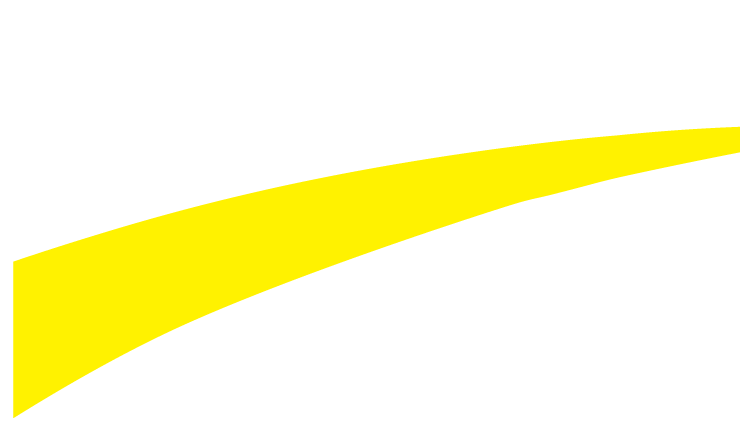

<h1 align="center">Hi, i'm <a href="https://ignacio-nieto.vercel.app/">Ignacio</a></h1>

  
  

  

## A passionate 💻FullStack Web Developer, I enjoy dreaming up ideas and making them come true with elegant interfaces. I care a lot about the experience, the architecture and the quality of the code in the things I build, that is why I am also self-taught and constantly reinvent myself with new technologies and tools💡🛠️.

 

---

 

# Take a look at my projects ☟🙇

# Henry Manager

## A very complete web platform that provides great management and administration in the Henry company, as well as helping students throughout the bootcamp.

### 🛠️ Technologies: 

  
  
  
  
  
  
  
  

 

---

 

# Ecommerce Patagonia

## A Patagonia beer ecommerce website

 

---

 

